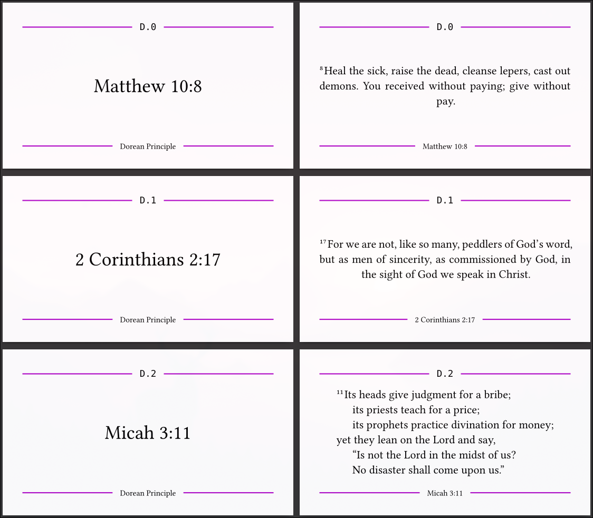
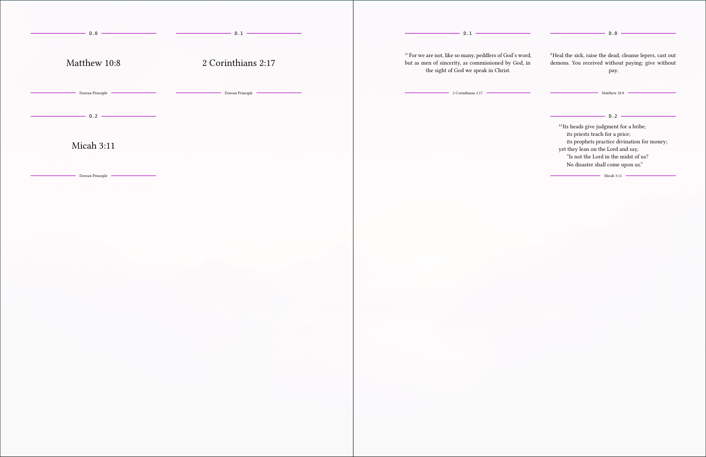

# 🗂️ Flashcardize

A Python command-line tool to convert a PDF of flashcards into a print-ready, cut-ready grid. This tool takes a PDF where each flashcard side is its own page and arranges them onto larger sheets, optimized for double-sided (duplex) printing.

## ⛪ Purpose

The goal of this program is to enable local churches and individuals to easily print their own memory verse flashcards.

## 📃 Description

Do you have a PDF of flashcards where the pages are ordered like `["Front 1", "Back 1", "Front 2", "Back 2", ...]`? This script helps you prepare it for printing.

It creates a new PDF with a grid layout:

One page contains all the "front" sides of the cards.
The next page contains all the corresponding "back" sides.
The layout is intelligently designed for duplex printing. The order of the cards on the back pages is mirrored and offset to ensure that when you print double-sided, each back aligns perfectly with its front, making cutting clean and simple.

### 🗂️ Flashcard Input



### 🗺️ Grid Output



#### ✂️ With Cut-Lines!

These are hard to see in the screenshot, but if you look closely, they are there:


## 💡 Features

- 🧩 **Automatic Layout:** Automatically determines the optimal number of rows and columns and the best page orientation (portrait or landscape) to fit the most cards per sheet.
- 🖨️ **Duplex-Ready:** Creates perfectly aligned front and back pages for hassle-free double-sided printing.
- 🔢 **Precise Alignment:** Incomplete rows are right-aligned on the front page, and the resulting empty space is used as an offset for the back page layout, ensuring perfect alignment after cutting.
- 📏 **No Scaling:** Your original flashcard dimensions are preserved. The script only arranges them; it does not stretch or shrink them.
- ⚙️ **Customizable:** Configure paper size, margins, and whether to include cut lines.
- 🔁 **Flip Option:** Includes a --flip-back option to rotate every second back-side sheet by 180°, which is useful for some printer configurations.

## 🧰 Requirements

This script requires [PyMuPDF](https://pymupdf.readthedocs.io/en/latest/), a powerful library for PDF manipulation.

Clone or download this script.
Install the dependency:

```bash
uv add pymupdf argparse
```

## 🚀 Usage

The script is run from the command line, providing an input PDF and a path for the output PDF.

### ⚙️ Basic Command

```bash
uv run main.py input_cards.pdf output_grid.pdf
```

This will create output_grid.pdf with a default paper size of 8.5x11 inches and a 0.25-inch margin.

### 🛠️ All Options & Help

You can see all available options and their default values by running the script with the --help flag:

```bash
uv run main.py --help

Output:

usage: main.py [-h] [--width WIDTH] [--height HEIGHT] [--margin MARGIN] [--lines {front,back,none,both}] [--flip-back] input output

Create a print-ready PDF grid of flashcards from an input PDF.

positional arguments:
  input                 Path to the input PDF file.
  output                Path to the output PDF file.

options:
  -h, --help            show this help message and exit
  --width WIDTH         Paper width in inches (override).
  --height HEIGHT       Paper height in inches (override).
  --margin MARGIN       Margin in inches.
  --lines {front,back,none,both}
                        Where to place cut-lines (if any): front, back, none, both
  --flip-back           Rotate every second sheet by 180° for duplex printing
```

### 🧮 Examples

#### 1. Custom Paper Size (e.g., A4)

A4 paper is 8.27 x 11.69 inches.

```bash
uv run main.py my_cards.pdf my_cards_a4.pdf --width 8.27 --height 11.69
```

#### 2. Smaller Margins

To fit more cards on a page, you can reduce the margins (if your printer supports it).

```bash
uv run main.py my_cards.pdf my_cards_tight.pdf --margin 0.10
```

#### 3. Remove Cut Lines

If you don't want guide lines for cutting, use the `--lines none` argument.

```bash
uv run main.py my_cards.pdf my_cards_clean.pdf --lines none
```

#### 4. Flipping Back Sheets

Some printers duplex by flipping on the short edge. If your backs are upside down, try this flag. It rotates every second sheet containing "back" sides by 180 degrees.

```bash
uv run main.py my_cards.pdf my_cards_flipped.pdf --flip-back
```

## 🧰 How It Works: The Layout Logic

The key to this tool is its layout algorithm, which is designed for perfect alignment after duplex printing.

**Separation:** The script first separates the input PDF pages into two lists: all odd-numbered pages (fronts) and all even-numbered pages (backs).

**Grid Calculation:** It calculates how many flashcards can fit on a single sheet of the target paper size, based on the original card dimensions and the specified margin. It automatically chooses the orientation (portrait or landscape) that fits the most cards.

**Front Page Layout:** It places the "front" cards onto a page. If a row is not completely full (e.g., the sheet can fit 3 cards across but you only have 2 left), the cards are right-aligned in that row.

**Back Page Layout & Offset:** This is the crucial step. To ensure the backs align with the fronts:

- The script calculates the total empty space on the right side of the front page layout.
- It uses this empty space as an additional offset for the left margin when drawing the "back" cards.
- The "back" cards are laid out in a mirrored order.

Example: Imagine your card size allows 3 per row. You have 5 cards total.

Front Page 1:

```
|1 2 3  |
|4 5 _  |
```

Back Page 1:

The layout starts with a left margin equal to the width of one card (the empty space from the front page).

```
|  3 2 1|
|  _ 5 4|
```

When you print this double-sided and cut along the lines, Card 1 Front will be perfectly backed by Card 1 Back, and so on.

## 🧠 Acknowledgements

- [Grok](https://grok.com/) did about half the work.

---

## ©️ Licensing

You can copy, translate, modify, and distribute this resource, without restriction, and without needing to ask permission.

This resource is freely given (Matt 10:8) for the sake of the gospel.

[](https://sellingjesus.org/free)
